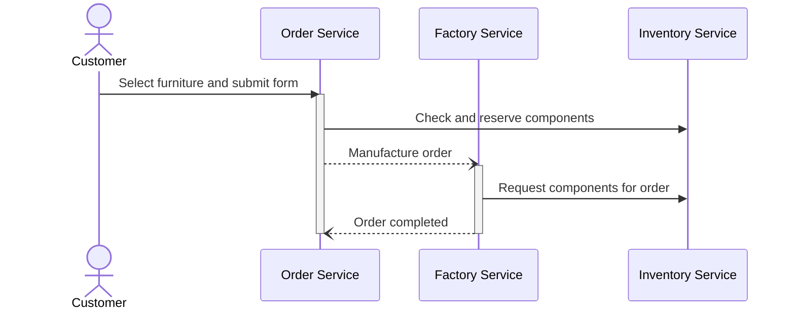

# Event-driven and Process-oriented Architectures - Group 1
This repository contains all code related to the project and assignments.

# Project Description
The project simulates a factory that produces custom furniture on order.
The customer can select a type of furniture (chair, table, shelf, closet) and a colour, the factory then fetches the components from inventory and assembles them using the robot arms.

# Sequence Diagram

## Successful Order Flow 


## Failure During Manufacturing

## Inventory not Sufficient

# Inventory Management
The inventory is represented by a grid, each cell can either contain a block of a certain colour, or be empty.
Additionally, occupied cells can be reserved for an order and not be available for further orders.

Example of inventory grid state:
```
+---+---+---+---+
| R |   |   |   |
+---+---+---+---+
| R |   |   | Y |
+---+---+---+---+
| R |   |   | Y |
+---+---+---+---+
| R | G |   | Y |
+---+---+---+---+
| R | G | B | Y |
+---+---+---+---+
```

X coordinate represents row, top to bottom.
Y coordinate represents column, left to right.

Coordinates on grid (x,y):
```
+-----+-----+-----+-----+
| 0,0 | 0,1 | 0,2 | 0,3 |
+-----+-----+-----+-----+
| 1,0 | 1,1 | 1,2 | 1,3 |
+-----+-----+-----+-----+
| 2,0 | 2,1 | 2,2 | 2,3 |
+-----+-----+-----+-----+
| 3,0 | 3,1 | 3,2 | 3,3 |
+-----+-----+-----+-----+
| 4,0 | 4,1 | 4,2 | 4,3 |
+-----+-----+-----+-----+
```

## Inventory Service API
Refer to [Inventory Service Readme](services/inventory/README.md)

# Data Structures
## Enums
### ItemType
| Value  | Description         |
|--------|---------------------|
| Chair  | 1 block             |
| Table  | 2 blocks horizontal |
| Shelf  | 2 blocks vertical   |
| Closet | 3 blocks vertical   |

### BlockColour
| Value  |
|--------|
| Red    |
| Green  |
| Blue   |
| Yellow |

## OrderDto
| Field    | Type          | Content                     |
|----------|---------------|-----------------------------|
| orderId  | string        | Order UUID                  |
| itemType | Enum.ItemType | Name of item to manufacture |

## ReserveInventoryDto
| Field   | Type             | Content                     |
|---------|------------------|-----------------------------|
| orderId | string           | Order UUID                  |
| count   | int              | Number of blocks to reserve |
| colour  | Enum.BlockColour | Colour of blocks to reserve |

## InventoryPositionDto
| Field  | Type             | Content                        |
|--------|------------------|--------------------------------|
| x      | int              | X coordinate of inventory grid |
| y      | int              | Y coordinate of inventory grid |
| colour | Enum.BlockColour | Colour of block                |

# Kafka Topics
Customer service subscribes to all topics and displays live information form the received events.

## Error
Error messages, feedback from Factory to Order service:
`error.v1`

| Field         | Type   | Content                                                 |
|---------------|--------|---------------------------------------------------------|
| message       | string | Message for user                                        |
| orderId       | string | Order ID                                                |
| correlationId | string | UUID to correlate message, not used by Customer service |

## Info
Information messages, Customer service subscribes to this:
`info.v1`

| Field         | Type   | Content                                                 |
|---------------|--------|---------------------------------------------------------|
| message       | string | Message for user                                        |
| orderId       | string | Order ID                                                |
| correlationId | string | UUID to correlate message, not used by Customer service |

## Order
`order.manufacture.v1`: command from Order to Factory service:

| Field         | Type      | Content                   |
|---------------|-----------|---------------------------|
| order         | OrderDto  | Order to be manufactured  |
| correlationId | string    | UUID to correlate message |

`order.complete.v1`: feedback from Factory to Order service:

| Field         | Type    | Content                      |
|---------------|---------|------------------------------|
| orderId       | string  | Order that was manufactured  |
| correlationId | string  | UUID to correlate message    |
