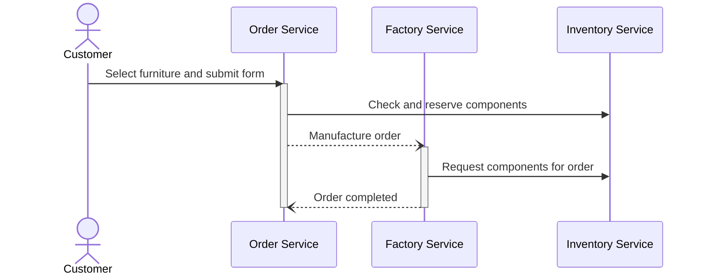
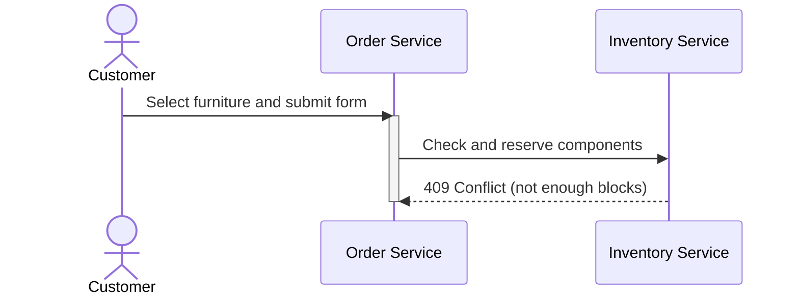

# Event-driven and Process-oriented Architectures - Group 1
This repository contains all code related to the project and assignments.

# Project Description
The project simulates a factory that produces custom furniture on order.
The customer can select a type of furniture (chair, table, shelf, closet) and a color, the factory then fetches the components from inventory and assembles them using the robot arms.
Besides the Inventory Service, the system includes an Order Service, a Factory Service, and a Customer Service for status updates.
Communication with the Inventory Service uses HTTP/REST APIs, while communication between the other services is event-driven via Kafka.

# Sequence Diagram

## Successful Order Flow 


## Failure During Manufacturing

## Inventory not Sufficient


# Inventory Management
The inventory is represented by a grid, each cell can either contain a block of a certain color, or be empty.
Additionally, occupied cells can be reserved for an order and not be available for further orders.

Example of inventory grid state:
```
+---+---+---+---+
| R |   |   |   |
+---+---+---+---+
| R |   |   | Y |
+---+---+---+---+
| R |   |   | Y |
+---+---+---+---+
| R | G |   | Y |
+---+---+---+---+
| R | G | B | Y |
+---+---+---+---+
```

X coordinate represents row, top to bottom.
Y coordinate represents column, left to right.

Coordinates on grid (x,y):
```
+-----+-----+-----+-----+
| 0,0 | 0,1 | 0,2 | 0,3 |
+-----+-----+-----+-----+
| 1,0 | 1,1 | 1,2 | 1,3 |
+-----+-----+-----+-----+
| 2,0 | 2,1 | 2,2 | 2,3 |
+-----+-----+-----+-----+
| 3,0 | 3,1 | 3,2 | 3,3 |
+-----+-----+-----+-----+
| 4,0 | 4,1 | 4,2 | 4,3 |
+-----+-----+-----+-----+
```

## Inventory Service API
Refer to [Inventory Service Readme](services/inventory/README.md)
Base URL `http://localhost:8000`

### Reserving Blocks from Inventory
`POST /reserve`

**Request body**  
Content is _ReserveInventoryDto_  
Example request body:
```json
{
  "orderId": "UUID",
  "count": 2,
  "color": "RED"
}
```

**Response: 200 OK**  
The blocks for this orderId have been reserved, no body.

**Response: 400 Bad Request**  
The request is not valid.
```json
{
  "message": "Unknown color: purple. Valid colors: ['RED', 'GREEN', 'BLUE', 'YELLOW']"
}
```

**Response: 409 Conflict**  
The inventory does not contain enough free blocks of the requested color.
```json
{
  "detail": "Not enough yellow blocks. Requested: 3, available: 2"
}
```

### Fetching Positions of Reserved Blocks
`GET /reserve?orderId=UUID`

**Response: 200 OK**  
Returns the list of positions of the reserved blocks.
Content is _FetchInventoryDto_

```json
{
  "positions": [
    {
      "x": 1,
      "y": 0,
      "color": "RED"
    },
    {
      "x": 2,
      "y": 0,
      "color": "RED"
    }
  ]
}
```

**Response: 404 Not Found**  
The requested orderId is not known (might not have been reserved).


# Data Structures
## Enums
### ItemType
| Value  | Description         |
|--------|---------------------|
| CHAIR  | 1 block             |
| TABLE  | 2 blocks horizontal |
| SHELF  | 2 blocks vertical   |
| CLOSET | 3 blocks vertical   |

### BlockColor
| Value  |
|--------|
| RED    |
| GREEN  |
| BLUE   |
| YELLOW |

## OrderDto
| Field    | Type          | Content                     |
|----------|---------------|-----------------------------|
| orderId  | string        | Order UUID                  |
| itemType | Enum.ItemType | Name of item to manufacture |

## ReserveInventoryDto
| Field   | Type            | Content                     |
|---------|-----------------|-----------------------------|
| orderId | string          | Order UUID                  |
| count   | int             | Number of blocks to reserve |
| color   | Enum.BlockColor | Color of blocks to reserve  |

## InventoryPositionDto
| Field | Type            | Content                        |
|-------|-----------------|--------------------------------|
| x     | int             | X coordinate of inventory grid |
| y     | int             | Y coordinate of inventory grid |
| color | Enum.BlockColor | Color of block                 |

### FetchInventoryDto
| Field     | Type                       | Content                                  |
|-----------|----------------------------|------------------------------------------|
| positions | List<InventoryPositionDto> | List of positions to take from inventory |

# Kafka Topics
Customer service subscribes to all topics and displays live information from the received events.

## Error
Error messages, feedback from Factory to Order service:
`error.v1`

| Field         | Type   | Content                                                 |
|---------------|--------|---------------------------------------------------------|
| message       | string | Message for user                                        |
| orderId       | string | Order ID                                                |
| correlationId | string | UUID to correlate message, not used by Customer service |

## Info
Information messages, Customer service subscribes to this:
`info.v1`

| Field         | Type   | Content                                                 |
|---------------|--------|---------------------------------------------------------|
| message       | string | Message for user                                        |
| orderId       | string | Order ID                                                |
| correlationId | string | UUID to correlate message, not used by Customer service |

## Order
`order.manufacture.v1`: command from Order to Factory service:

| Field         | Type      | Content                   |
|---------------|-----------|---------------------------|
| order         | OrderDto  | Order to be manufactured  |
| correlationId | string    | UUID to correlate message |

`order.complete.v1`: feedback from Factory to Order service:

| Field         | Type    | Content                      |
|---------------|---------|------------------------------|
| orderId       | string  | Order that was manufactured  |
| correlationId | string  | UUID to correlate message    |
