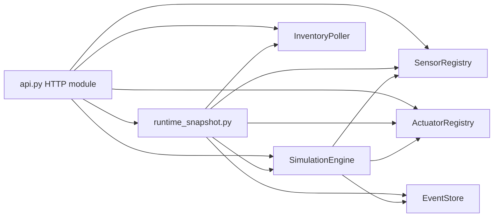

## Context

`api.py` currently mixes two read-side patterns. Some routes ask the engine for state it truly owns, such as run status, active gates, and pending actions. Other routes ask the engine for state the engine only forwards, such as inventory cache, preset catalog, sensor configs, and dobot runtime state. At the same time, `/api/status`, the UI fragment handlers, and `GET /sse/status` rebuild related panel context in multiple places, so one change to the read model requires edits across JSON routes, fragment routes, and the SSE renderer.

The change needs to improve locality without changing the public simulator contract. Existing HTTP endpoints, HTML fragments, and SSE behavior stay in place; the internal read seam changes underneath them.

## Goals / Non-Goals

**Goals:**
- Route read-only state lookups through the module that owns the state rather than through engine pass-through methods.
- Introduce one runtime snapshot module for fragment rendering and SSE updates.
- Keep the engine focused on lifecycle state, gating, pending actions, and command handling.
- Preserve existing HTTP paths, payload shapes, and htmx/SSE behavior.
- Make read-side tests target one seam per concern.

**Non-Goals:**
- No new public endpoints, Kafka topics, or protocol changes.
- No redesign of template markup beyond what the snapshot module needs.
- No change to preset execution semantics or interactive-command behavior.
- No move of twin badge/grouping template logic out of Jinja in this change.

## Decisions

### 1. Move state owners and read seams into dependency wiring

`deps.py` will construct and return the read owners plus the composed read seam used by the HTTP layer:

- `SensorRegistry` owns the live sensor pool and raw preset catalog.
- `ActuatorRegistry` keeps its current name and becomes the sole live dobot state owner.
- `InventoryPoller` remains the owner of cached inventory state.
- `EventStore` remains the owner of event history.
- `RuntimeSnapshot` is built from the engine plus the ownership-backed read modules and is exposed to `api.py` for composed reads.

`SimulationEngine` will stop constructing sensor and actuator owners internally. Instead, it will consume injected `SensorRegistry` and `ActuatorRegistry` instances for command execution and lifecycle transitions. Once owner construction moves out, the engine constructor also drops inputs that no longer match actual ownership: `config_path`, `inventory_poller`, and the currently unused `event_bridge`.

`create_app()` will store `sensor_registry`, `actuator_registry`, `inventory_poller`, `event_store`, and `runtime_snapshot` on `app.state` so API tests have a stable internal seam instead of reaching through private engine fields.

**Alternative considered:** keep the current engine facade and add more getter methods. Rejected because that makes the engine interface wider while the implementation remains one-line delegation.

### 2. Use `runtime_snapshot.py` only for composed, data-only reads

Introduce a read-side module, `runtime_snapshot.py`, responsible for assembling the data used by:

- `GET /api/status`
- `GET /fragments/status`
- `GET /fragments/presets`
- `GET /fragments/twin`
- `GET /fragments/events`
- `GET /fragments/pending`
- `GET /sse/status`

The module will consume engine lifecycle state plus ownership-backed reads from the registries and adapters. It returns plain view-data structures rather than rendered HTML. Jinja rendering stays in `api.py` and the templates.

The module exposes coarse methods such as `status_view()`, `presets_view()`, `twin_view()`, `pending_view()`, and `all_panels(filter_mode)`. `all_panels(filter_mode)` must capture one coherent read cycle and derive all panel data from that base snapshot rather than chaining independent panel reads.

Single-owner endpoints do not route through `runtime_snapshot`. `api.py` reads them directly from the owning modules:

- `GET /api/presets` and `GET /api/config/sensors` from `SensorRegistry`
- `GET /api/inventory` from `InventoryPoller`
- `GET /api/dobot/{name}/state` from `ActuatorRegistry`

**Why:** the HTTP module wants one coherent composition surface for multi-owner views, not a new god-facade for every read.

**Alternative considered:** put helper functions inside `api.py`. Rejected because the duplicated read composition is the problem; moving it into private functions inside the same file would not create a durable seam.

### 3. Narrow the engine interface to lifecycle state and writes

After the change, engine reads remain only where the engine owns the behavior:

- `get_status()` returning a lifecycle-only status model
- `get_pending_actions()`
- `get_interactive_config()` / `set_interactive_config()`
- gate and preset execution methods
- step-aware color and IR reads

`update_sensor()` stays on the engine for now as a write-side operation because it records simulator state events and is outside the scope of this read-model refactor.

The following pass-through methods are removed from the engine surface and replaced by direct ownership-backed reads in `api.py` or `runtime_snapshot.py`:

- `list_presets()`
- `get_sensor_configs()`
- `get_dobot_state()`
- `get_inventory_cache()`

The internal engine status model is split from the public `/api/status` payload. `runtime_snapshot.status_view()` preserves the current HTTP shape, including dobot runtime state, by composing actuator state outside the engine.

### 4. Keep template semantics in Jinja while stabilizing the read seam

The twin panel keeps its current template-owned badge mapping and sensor grouping logic. `runtime_snapshot` supplies the assembled data needed by the templates but does not absorb every derived presentation rule in this change.

This keeps markup churn low and preserves current fragment behavior, at the cost of keeping a small amount of semantic view logic in template code.

### 5. Keep HTTP contracts stable while changing internal routing

External routes keep their existing method, path, and payload shape. The contract change is internal Python-module ownership and read composition.

REST surfaces preserved:

- `GET /api/status`
- `GET /api/presets`
- `GET /api/config/sensors`
- `GET /api/inventory`
- `GET /api/dobot/{name}/state`
- `GET /fragments/*`
- `GET /sse/status`

Notable internal routing changes:

- `GET /api/status` now reads through `runtime_snapshot` so it shares the same composed status path as the UI.
- `GET /api/presets` maps raw preset definitions outside `SensorRegistry` to preserve the existing payload shape.
- Color and IR reads remain on the engine because they are still step-aware.

No Kafka topic or message contract changes are part of this change.

### 6. Test at the owning seam for each concern

- Add focused unit tests for `ActuatorRegistry` owner methods and for `runtime_snapshot`.
- Update API wiring tests to use `app.state.sensor_registry`, `app.state.actuator_registry`, `app.state.inventory_poller`, and `app.state.runtime_snapshot` instead of private engine internals where possible.
- Keep fragment tests covering twin badge/group semantics that remain in Jinja.
- Keep fragment and SSE route tests mostly at contract or smoke level outside those template-specific semantics.

## Architecture Diagram

## Risks / Trade-offs

- [More dependencies in `deps.py` and `app.state`] -> Acceptable. Construction gets wider, but runtime ownership and test seams become explicit.
- [ActuatorRegistry changes shape from factory to owner] -> Mitigate with focused unit tests for reset, state queries, and command application before touching API wiring.
- [UI snapshot module can become a dumping ground] -> Keep its interface coarse, data-only, and reserved for multi-owner composed reads.
- [Twin semantic view logic remains partly in Jinja] -> Acceptable for this change. Fragment tests keep covering badge/grouping behavior until that logic moves.
- [Removing unused engine constructor inputs widens the refactor slightly] -> Acceptable because it aligns the engine surface with actual ownership instead of preserving dead plumbing.

## Migration Plan

1. Deepen `ActuatorRegistry` into the sole live dobot state owner, keep its current name, and add explicit apply/state/reset operations with focused tests.
2. Move `SensorRegistry` and `ActuatorRegistry` construction into `deps.py`, inject them into `SimulationEngine`, remove `config_path`/`inventory_poller`/`event_bridge` from the engine constructor, and introduce a lifecycle-only engine status model.
3. Add `runtime_snapshot.py` and route `GET /api/status`, fragment handlers, and `GET /sse/status` through one shared, data-only snapshot path with coherent `all_panels(filter_mode)` behavior.
4. Update `api.py` to keep single-owner endpoints direct, preserve existing payload shapes, and expose `runtime_snapshot` plus the ownership-backed read modules on `app.state`.
5. Update unit and integration tests to verify direct reads, snapshot composition, app wiring, and template-owned twin semantics at the right seam.
6. Run the simulated-factory test suite and a focused UI smoke test.

## Resolved Questions

- `ActuatorRegistry` keeps its current name in this change.
- `GET /api/presets` reads raw preset definitions from `SensorRegistry` and maps them to the existing response shape outside the registry.