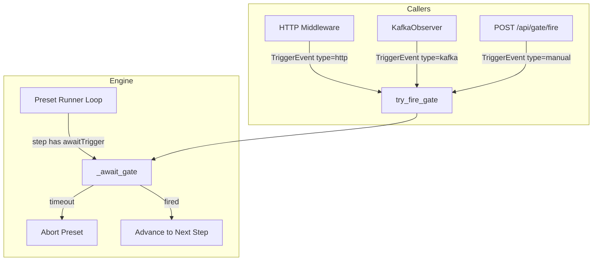

## Context

The simulated-factory service (`services/simulated-factory`) is a Python 3.13 FastAPI application that drives a digital-twin simulation of a furniture factory. It runs preset step sequences that publish sensor updates and wait for external signals before advancing. Currently two independent mechanisms handle "wait for signal":

1. **`awaitRequest`** — declared per-step in preset YAML; holds until a matching HTTP request arrives (or `delayMs` timeout).
2. **Interactive command gating** — runtime config; intercepts any incoming command matching a set of command types, holds it as a `PendingAction` for operator approval.

Both use `asyncio.Event` internally but share no abstraction, have incompatible timeout semantics, and cannot be extended to non-HTTP trigger sources.

## Goals / Non-Goals

**Goals:**
- Single gate primitive (`awaitTrigger`) that supports HTTP, Kafka, and manual (UI) trigger types
- Declarative per-step gate configuration in preset YAML
- Clean removal of interactive command gating subsystem
- `KafkaObserver` gains ability to fire gates (topic-match only)
- `POST /api/gate/fire` endpoint for manual triggers
- Timeout aborts the preset run (fail-fast)
- Evolve `PendingAction` to display gate state in the HTMX UI

**Non-Goals:**
- Complex Kafka matching (key/header filtering) — topic-only for now
- Multiple simultaneous gates per step
- Runtime mode switching (interactive flag at preset level)
- Backward compatibility with old `awaitRequest` format
- Changes to the Java services (factory, order, dashboard)

## Decisions

### D1: Single `awaitTrigger` field replaces both mechanisms

**Choice**: One discriminated-union field on `PresetStep` with `type` as discriminator.

```python
class AwaitTrigger(BaseModel):
    type: Literal["http", "kafka", "manual"]
    # HTTP
    method: str | None = None
    path: str | None = None
    # Kafka
    topic: str | None = None
    # Common
    timeoutMs: int = 30000
```

**Rationale**: Keeps config declarative, extensible (add `type: mqtt` later), and avoids separate code paths per gate kind. Pydantic model validators enforce field presence per type.

**Alternative rejected**: Separate fields (`awaitHttp`, `awaitKafka`, `awaitManual`) — more fields to maintain, harder to enforce "exactly one gate per step."

### D2: Mutual exclusivity of `delayMs` and `awaitTrigger`

**Choice**: Pydantic `model_validator` on `PresetStep` raises `ValueError` if both are present.

**Rationale**: A step is either timed (sleep) or gated (wait for signal). Mixing them creates ambiguous semantics.

### D3: Single `try_fire_gate(TriggerEvent)` engine method

**Choice**: One entry point for all callers (HTTP middleware, KafkaObserver, manual endpoint).

```python
@dataclass
class TriggerEvent:
    type: Literal["http", "kafka", "manual"]
    method: str | None = None
    path: str | None = None
    topic: str | None = None
```

The engine matches `TriggerEvent.type` against the active gate's `awaitTrigger.type`, then validates type-specific fields (method+path for HTTP, topic for Kafka, unconditional for manual).

**Alternative rejected**: Separate `fire_http_gate()`, `fire_kafka_gate()`, `fire_manual_gate()` — more surface area, duplicated match logic.

### D4: KafkaObserver calls engine directly

**Choice**: Inject a gate-firing interface into `KafkaObserver`. On each consumed message, call `engine.try_fire_gate(TriggerEvent(type="kafka", topic=record.topic))`.

**Rationale**: Simplest wiring. No internal queues or separate consumers needed. Observer already runs in its own asyncio task.

### D5: Timeout aborts preset

**Choice**: When `timeoutMs` elapses without the gate firing, the engine emits an error event and terminates the preset run.

**Rationale**: Fail-fast semantics prevent silent failures. Manual reject also triggers abort (reject = timeout-equivalent).

**Alternative rejected**: Auto-fire on timeout (old behavior) — hides integration failures in demos.

### D6: Sensor updates apply immediately

**Choice**: `sensorUpdates` on a gated step apply when the step starts (before the gate wait), not when the gate fires.

**Rationale**: Gate is purely a synchronization point. Sensor state represents "the physical world at this step", not "pending until approved."

### D7: Remove `triggerMqtt`

**Choice**: Delete the `triggerMqtt` field from `PresetStep` and its publishing logic in the engine.

**Rationale**: Legacy from a previous design. MQTT publishing will be handled differently outside the preset mechanism.

### D8: Replace interactive API with `/api/gate/fire`

**Choice**: Remove `/api/interactive/*` (config, pending, resolve endpoints). Add `POST /api/gate/fire` which fires the currently active manual gate.

**Rationale**: Only one gate is active at a time. No need for action IDs, queues, or start/stop lifecycle.

### D9: Kafka topic subscription stays explicit in config

**Choice**: Topics that can fire gates must be listed in the `kafka.topics` section of `config.yml`. No dynamic subscription.

**Rationale**: Predictable, auditable. Avoids runtime rebalancing complexity.

## Architecture



## Risks / Trade-offs

- **Breaking change to all presets** → Mitigated by migrating all presets in one commit; no external consumers of the YAML format.
- **Kafka gate fires on any message on the topic** → Acceptable for current use cases; can add key/header filtering later without breaking the model.
- **Timeout aborts may surprise users in demos** → Set generous `timeoutMs` (60s) on manual steps; UI shows countdown.
- **Removing interactive gating removes runtime flexibility** → Acceptable trade-off for simplicity; runtime interception was rarely used outside manual presets (which now use `type: manual` explicitly).
- **KafkaObserver coupling to engine** → Mitigated by injecting a thin protocol/interface, not the full engine object.

## Migration Plan

1. Implement new models (`AwaitTrigger`, `TriggerEvent`, evolved `PendingAction`)
2. Refactor engine gate logic to use `try_fire_gate`
3. Update `KafkaObserver` to inject engine and fire gates
4. Add `POST /api/gate/fire` endpoint
5. Remove interactive endpoints and `InteractiveConfig`
6. Remove `triggerMqtt` from model and engine
7. Migrate all presets in `config.yml` to new `awaitTrigger` format
8. Update/rewrite affected tests
9. Update UI templates to render gate state from evolved `PendingAction`
