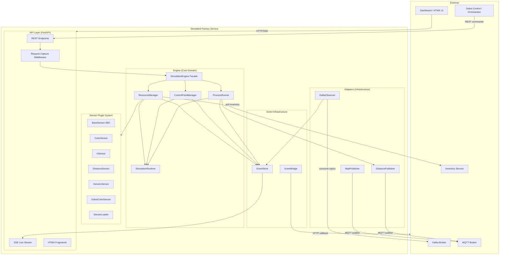
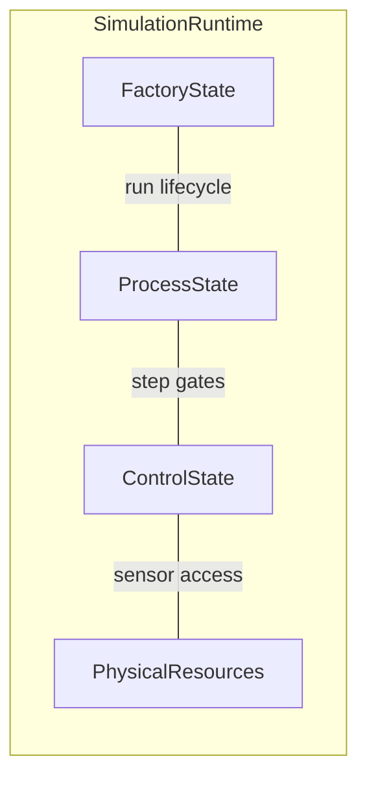
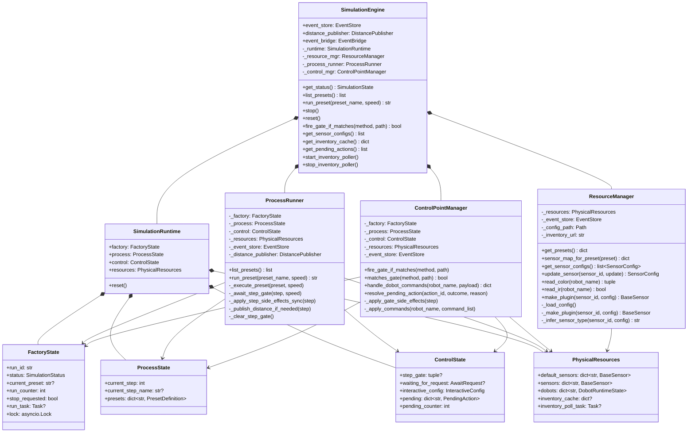
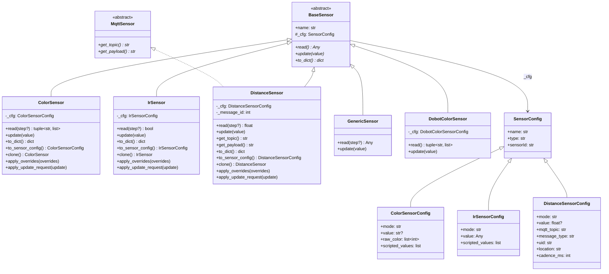
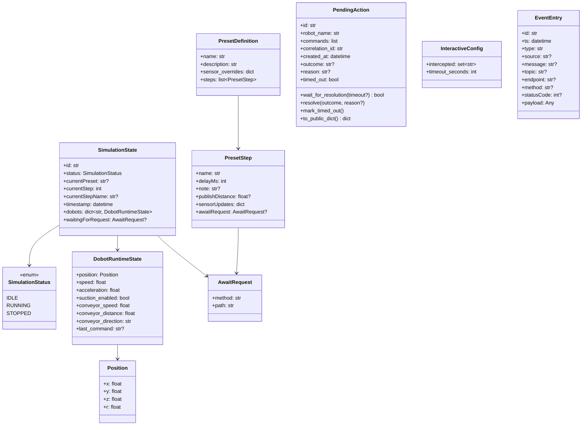
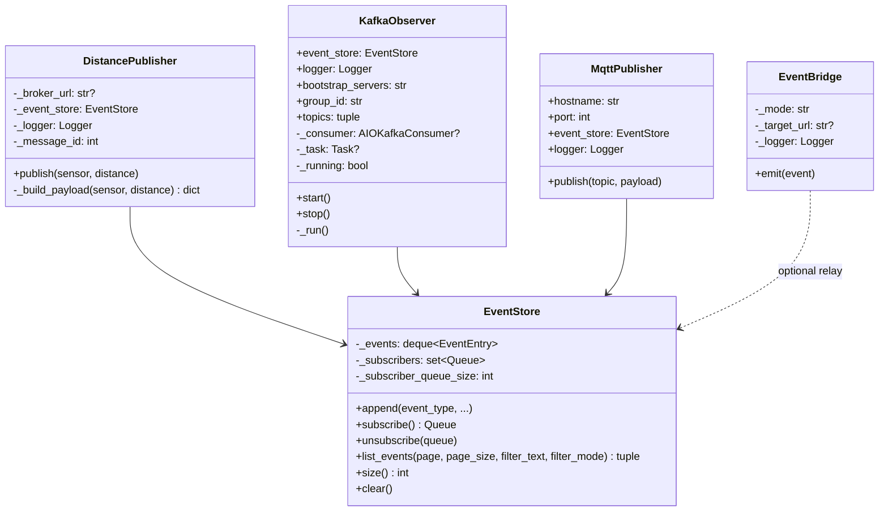
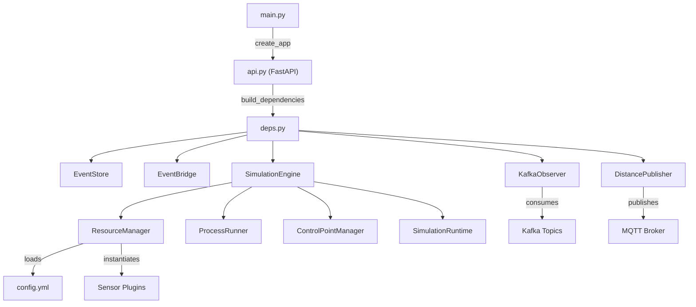
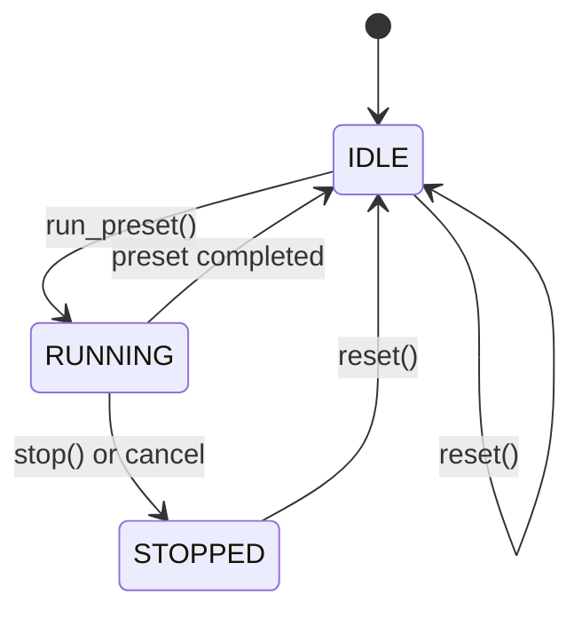
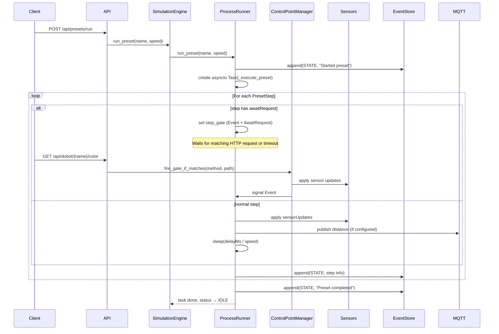

# Simulated Factory — Architecture

## Overview

The **Simulated Factory** is a FastAPI-based service that emulates a physical factory with dobot robots, conveyor belts, and sensors. It executes scripted presets (step sequences), exposes a REST/SSE API for dashboards and orchestrators, and integrates with Kafka and MQTT for event-driven communication.

---

## Component Diagram

---

## Runtime State Diagram

---

## Class Diagram — Engine

---

## Class Diagram — Sensor Plugin System

---

## Class Diagram — Models (API / Domain)

---

## Class Diagram — Adapters & Events

---

## Dependency Wiring

---

## Simulation Lifecycle (State Machine)

---

## Preset Execution Sequence

---

## Key Design Decisions

| Decision | Rationale |
|----------|-----------|
| **Facade pattern** (SimulationEngine) | Single entry point for API; delegates to focused sub-components |
| **Runtime dataclasses** vs Pydantic models | Mutable internal state (dataclass) separate from immutable API snapshots (Pydantic) |
| **Plugin-based sensors** | New sensor types added by dropping a module in `sensors/`; resolved by naming convention |
| **Request gating** | Steps can pause until a real HTTP request arrives, enabling realistic timing |
| **In-memory EventStore** | Bounded deque with pub/sub queues for real-time SSE without external dependencies |
| **Kafka Observer (read-only)** | Makes upstream process-topic activity visible in the UI without producing |
| **DistancePublisher via MQTT** | Emulates Tinkerforge-style distance messages consumed by downstream services |
